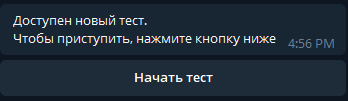

# Модуль работы с тестами/опросами для telegram бота ППвИС

Проверить работу бота можно тут - [@PPvISTest_bot](https://t.me/PPvISTest_bot)

Ссылка на таблицу, в которой составляется тест - [тык](https://docs.google.com/spreadsheets/d/1Fl0CCFGAJ3fjBtd1m2B7YTAU5VEw4J_MA-3wcxQ2Ph8/edit?usp=sharing)

Пока что все пользователи, чей telegram id не внесен в конфиг, считаются студентами,
если он внесен - преподавателями.

Также сейчас лист с тестом можно назвать только "Тест", а колонку с вопросами только "Вопрос".

### Алгоритм работы

#### Преподаватель
1. Формирует тест в специальной таблице, ссылка на которую есть выше. 
2. Заходит в переписку с ботом и, если еще не пользовался им, пишет /start, после чего вызывает меню(/menu)
3. В меню преподаватель может:
   1. Проверить как будет выглядеть тест, нажав на кнопку "Проверить вопросы"
   2. Запустить опрос. После запуска опроса всем студентам отправится сообщение с кнопкой о том, что они могут
начать проходить тест

#### Студент
Меню для студента пока не реализовано.

Когда приходит сообщение о новом тесте, студент может нажать на кнопку "Начать тест",
после чего сообщение заменится на первый вопрос. Каждый вопрос будет меняться на следующий после ответа.

После прохождения теста выводится сообщение с количеством правильных ответов.
Пока правильные ответы никуда не записываются, эта функция будет реализована вместе с меню студента. 